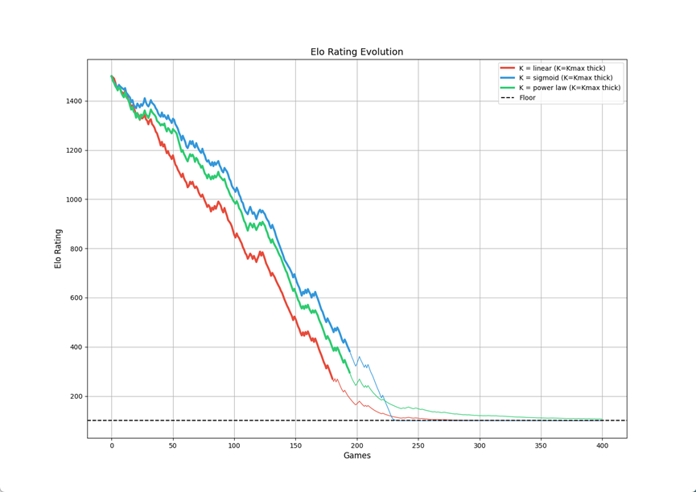

# 001-Elo-rating-system
Elo算法由匈牙利裔美国物理学家阿帕德·埃洛首创,最初用于国际象棋界,后广泛应用与电子游戏和竞赛等领域。
#

## 一、什么是 Elo算法
Elo 算法有两个功能：
1.  根据双方分差,在对局开始前算出胜率  
2.  根据双方分差,在对局结束后更新分数  

---

### 1. 胜率计算公式
我们假设每一个玩家都有一个等级分 $R$,用来衡量他的水平。  
当两名玩家 A、B 对战,Elo 系统应该准确算出双方胜率。  

我们要求这个胜率计算公式满足以下几点：
- 二者的等级分差 $(R_a - R_b)$ 的取值范围是任意实数,也就是函数定义域是 $\mathbb{R}$  
- 胜率(函数值域)在 $(0,1)$ 区间  
- 当 $R_a - R_b$ 越大,A 的胜率应该越高；反之 B 的胜率越高  
- 玩家 A、B 的胜率 $E_a、E_b$ 相加等于 1  

注意到公式：  

$$
E_a = \frac{1}{1+m^{\frac{R_b - R_a}{n}}}, 
\quad 
E_b = \frac{1}{1+m^{\frac{R_a - R_b}{n}}}
$$

  正好满足以上四点

由于 Elo 被发明时(1960s),计算机没有被广泛应用于计算概率,人们大多靠手算和查对数表,所以取底数 $m=10$ 较为方便。  
因为 Elo 最初用于国际象棋界,当时的美国国际象棋协会在统计后认为,有 400 分分差的国际象棋选手的胜率应该约为 90% vs 10%,所以取 $n=400$。  

此时领先 400 分的国际象棋选手的胜率为：  

$$
E = \frac{1}{1+10^{-1}} = \frac{10}{11} \approx 90.9 \\% 
$$  

因此, $m=10$ , $n=400$ 经过历史的考验,被沿用至今。  

---

### 2. 分数更新公式
在一次 A 和 B 的对局中,有三种结果：
1. A 胜,B 负,记为 $S_a=1, S_b=0$  
2. 平局,记为 $S_a=S_b=0.5$  
3. A 负,记为 $S_a=0, S_b=1$  

  分数更新公式：  

$$
R_a^{new} = R_a^{old} + K_a(S_a - E_a)
$$

$$
R_b^{new} = R_b^{old} + K_b(S_b - E_b)
$$  

  这里的 $K$ 是学习率,用来控制分数变动程度。  
- $K$ 越大,分数波动越大  
- $K$ 越小,分数波动越小  

在国际象棋大师级比赛中, $K$ 通常取 16。  
在给新手定位时, $K$ 可以取较大值；对于老玩家, $K$ 取较小值。  

---

## 二、低分 Elo 的处理方法
在普通 Elo 算法下,会有负 Elo 分的情况,这会让人困惑；对于那些菜鸟玩家,如果 Elo 得分过低会打击其玩游戏的积极性。如何处理低 Elo 分的情况呢？  

### 1. 棋联做法
强制规定一个最低分,例如国际棋联(FIDE)曾规定的最低 Elo 分为 1000 分,如果低于这个分数,会被视为无等级分棋手,需要重新打定级赛。  

### 2. 自适应 K 因子法
在 Elo 分过低时,动态调整其 K 因子,让玩家即使全输也不会低于预设最低分 $R_{min}$。  

考虑最坏情况：玩家 A 一直输给远比自己弱的对手,所以 $S_a=0, E_a \to 1$。  
  
此时分数更新公式为：  

$$
R^{new} > R - K
$$  

  我们想让 $R^{new} > R_{min}$,那么只需要：  

$$
R - K \geq R_{min} \quad \Rightarrow \quad K \leq R - R_{min}
$$  

#### 几种基于不同 $K(R)$ 函数的方法
① 线性法  

$$
K = \min(K_{max}, \, c(R - R_{min})), \quad c \in (0,1]
$$  

② Sigmoid 法  

$$
K = \min \Big(K_{max}\cdot \sigma\big(\tfrac{R - R_{min}}{\tau}\big), \, R - R_{min}\Big),
\quad \sigma(x) = \frac{1}{1+e^{-x}}
$$  

③ 指数法  

$$
K = \min \Big(K_{max}, \, \alpha(R - R_{min})^p \, R - R_{min}\Big),
\quad \alpha \in (0,1], \, p \in (0,1]
$$  

---
我们编写python程序[3K_viz.py](./3K_viz.py)来可视化 K 函数的变化。

，让三种K(R)函数可视化
以下是一个例子:
- 规定 300~400 分为 K 函数生效的“预警”分段  
- 参数设定： $c=0.14$ , $\tau=7.86$ , $\alpha=0.01$ , $p=1.48$ , $K_{max}=25$ , $R_{min}=100$ ,胜率=20%  

结果如图：

  

可以看到
- Linear 方法下降最快,后期较为平稳  
- Sigmoid 方法下降最慢,后期掉分最快  
- exp方法下降速率适中,后期掉分最慢  

可以根据实际需求选择不同方法,调整相关方法的参数,以满足具体情况。  

---

## 三、多人对局和多结果下的 Elo 处理方法
在国际象棋中,如果忽略白先优势,是 1v1 的公平对战,对局结果也只有胜、平、负三种情况。  
但是在很多游戏中,通常有很多名玩家参与对局,例如 MOBA 游戏通常是 5v5；对局结果也可能有很多情况,例如 PUBG 的排名可以是 1~100 名。如何处理多人对局和多结果的情况呢？

### 1. 多人对局的 Elo 处理方法
① 简单平均  

胜率计算公式更改为：  

$$
E = \frac{1}{1+10^{\frac{R_{\text{敌方平均}} - R_{\text{己方平均}}}{100}}}
$$  

分数更新公式变为：  

$$
R^{new} = R^{old} + K(S - E)
$$  

缺点：忽略了队内 Elo 差异,容易出现菜鸟蹭局势,高手被拖累的情况。  

② TrueSkill 法(微软提出)  
通过 **高斯分布** 评估玩家水平,并用 **贝叶斯推断** 更新均值和方差,适合多人、多结果场景。  
